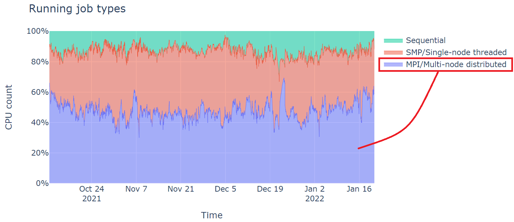
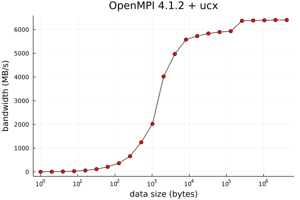

# MPI workshop series

1. Running MPI programs

    - How MPI programs and its runtime environment work

2. MPI Programming

    - Writing your own MPI code

3. Introducting to PETSc

    - Develop parallel/MPI code for solving science problems, simplified

4. Solving Partial Differential Equations on Parallel Computers

    - Case studies and examples of writing parallel PDE solvers

---


# Today's plan of attack

- MPI brief introduction
- Launching MPI processes
    - Controlling process distribution: machinefile, integration with the job scheduler
    - Managing shared library paths
- Examples of running MPI jobs on Hoffman2 Cluster
    - Some considerations and suggested practice
- Observations from a case study
- Running MPI-based Python, Julia...
- Debugging MPI programs using `gdb`
- Installing your own MPI library (without system admin's help)

Goal: understanding how things work so one can trouble shoot when problems occur.

# What is MPI (Message Passing Interface)?

- Standardized programming **interface** for distributed-memory communication in parallel scientific computing

    - [MPI 1.0](https://www.mpi-forum.org/docs/mpi-1.3/mpi-report-1.3-2008-05-30.pdf) released in 1994 (245 pages)

    - [MPI 2.0](https://www.mpi-forum.org/docs/mpi-2.0/mpi2-report.pdf) released in 1997 (370 pages)

    - [MPI 3.0](https://www.mpi-forum.org/docs/mpi-3.1/mpi31-report.pdf) released in 2012 (868 pages)

    - [MPI 4.0](https://www.mpi-forum.org/docs/mpi-4.0/mpi40-report.pdf) released in 2021 (1139 pages)


- **Interface**: think "function calls" in programming languages

- Enables **portable** parallel computing: from laptop computers to HPC clusters and supercomputers


# What's in the MPI Standard?

- Define the expected behavior of MPI function calls, e.g.

    - data transfer (communication) between processes

    - Synchronized or asynchronized actions, etc.

- Define the C/C++ and Fortran interfaces

- The MPI libraries ("implementatoins") should conform to the standard

- Understanding the standard helps users to write standard-conforming code

- Non-official interfaces exist in pratice, e.g. Python, R and Julia


# What does the standard look like?

from [MPI standard 4.0, p. 54](https://www.mpi-forum.org/docs/mpi-4.0/mpi40-report.pdf)

{ height=75% }


# MPI implementations (a.k.a. "MPI library")

Two popular MPI implementations (among others):

- [**MPICH**](https://www.mpich.org/downloads/) (open source)
    
  - [Intel MPI](https://www.intel.com/content/www/us/en/developer/tools/oneapi/mpi-library.html#gs.mpmlvx) 
    
  - [MVAPICH](https://mvapich.cse.ohio-state.edu/downloads/)

- [**Open MPI**](https://www.open-mpi.org/software/ompi/) (open source) $\rightarrow$ not to be confused with OpenMP

Your MPI source code remains the same no matter which implementation you use.

The usage of the runtime system may be slightly different. (more on this later)

You can install these on your PC or cluster account without root permission (more on this later)


# How a typical (sequential) program is compiled and run

```
gcc myprogram.c
```

{ width=70% }


# How an MPI program is compiled and run

{ width=95% }


- The user can transparently control how the processes are distributed.

- Processes communicate by making MPI calls (discussed in "MPI programming").


# Software layers: a simplified view

{ height=70% }


# Launching the MPI processes

To successfully run a MPI program, a user needs to manage:

1. MPI process distribution across the compute nodes

    - The "default" may work well for many cases
    - You can over-ride this if needed (more on this later)

2. Locations (paths) of the shared library files, including

    - MPI library
    - Your program (and all the library files it needs)
    - The runtime environment may be different from your login environment

These are the sources of mistakes in job failures.

#

Reminders:

- The runtime environment may not be the same as your interactive/terminal session. 

- A job/run script is robust if everything is specified clearly (i.e. self-documented).


# Two ways to specify share library paths

1. Use `LD_LIBRARY_PATH` environment variable $\rightarrow$ convenient/flexible

    Be aware of the difference between

    ```
    export LD_LIBRARY_PATH=/path/to/lib1:/path/to/lib2
    ```

    and

    ```
    export LD_LIBRARY_PATH=/path/to/lib1:/path/to/lib2:$LD_LIBRARY_PATH
    ```

    Using "Modules" helps setting up (some of the) `LD_LIBRARY_PATH`.

2. Embeded the path in the executable $\rightarrow$ robust

    Does not need `LD_LIBRARY_PATH` -- immune to environment changes

    To embed the library path in the executable file:

    ```
    gcc -Wl,-rpath,/path/to/lib -L/path/to/lib ...
    ```


# Process distribution: "machine file"

A text file as an input to `mpirun`, one line per "machine" (or compute node). 

Specifies how the MPI processes are distributed across compute nodes.

MPICH (Intel MPI) format:
```
n1:4
n2:4
```

OpenMPI format:
```
n1 slots=4
n2 slots=4
```


# Machine file on HPC cluster

On an HPC cluster, the machine file is managed by the job scheduler (by default)

However, you may need to create your own machine file when:

- Some MPI programs prefers certain process distribution (e.g. runs faster)
- Benchmark purposes

We don't know in advance which compute nodes will be used until the job starts running


# Where can you run MPI programs?

MPI programs are portable.

- Your laptop or desktop computers $\Rightarrow$ for **development and initial testing**

  - Easy to do on Mac and Linux, or Docker/virtual machine on MS-Windows.

- Hoffman2 Cluster, or any other HPC clusters $\Rightarrow$ for **medium-size runs**

- Supercomputers (e.g. NSF or DOE supercomputer centers) $\Rightarrow$ for **bigger runs**


You can install MPI libraries independently on any computers without "root" permission.


# Hoffman2 Cluster Job Types




# MPI on Hoffman2 Cluster

There are 3 MPI libraries available on Hoffman2 cluster:

```
$ module avail intel/18.0.4                  # or: module avail intel
--------------------- /u/local/Modules/modulefiles -----------
intel/18.0.4
```

```
$ module avail openmpi/4.1                   # or: module avail openmpi
-------------------- /u/local/Modules/modulefiles ------------
openmpi/4.1
```

```
$ module avail mpich                         # or: module avail mpich
-------------------- /u/local/Modules/modulefiles ------------
mpich/3.4(default)
```


# Running a standard MPI job on Hoffman2 Cluster

Using `-pe dc*` allows the processes to distribute multiple nodes:

```
#!/bin/bash -l
#$ -j y
#$ -o stdout.$JOB_ID
#$ -l h_data=4G,h_rt=1:00:00
#$ -pe dc* 32
#$ -cwd

module load mpich/3.4    # or module load mpich/4.1 etc.
mpirun -n $SLOTS a.out
```

$\Rightarrow$ Note the `-l` option in the first line -- bash runs as a login shell.

# 

For small runs, use `-pe shared` so all processes run on ONE compute node:

```
#!/bin/bash -l
#$ -j y
#$ -o stdout.$JOB_ID
#$ -l h_data=4G,h_rt=1:00:00
#$ -pe shared 8
#$ -cwd

module load mpich/3.4
mpirun -n $SLOTS a.out
```

Of course, ``(-pe shared)*(h_data)`` cannot exceed a compute node's memory size.


#

Alternatively (or traditionally):

```
#!/bin/bash
#$ -j y
#$ -o stdout.$JOB_ID
#$ -l h_data=4G,h_rt=1:00:00
#$ -pe dc* 32
#$ -cwd

source /u/local/Modules/default/init/modules.sh   # enable Modules
source $HOME/.bash_profile                        # optional
module load mpich/3.4
mpirun -n $SLOTS a.out
```


# A reminder for Windows users 1/3

The job script needs to be a text file properly formatted on Linux. 

If you transfer the job script from MS-Windows to Hoffman2 Cluster (Linux), you need to be aware of Windows' end of line characters (`\r\n`) can cause the script to fail on Linux which uses `\n`.

To fix this, there are several options:

- Run `dos2unix your_script.sh` on Hoffman2 cluster, before using the script.

- Your text editors on MS-Windows may have a setting that can control this. For example, popular Windows text editors like Notepad++, VS-Code all support this.


# A reminder for Windows users 2/3

Use the `cat -v` command to quickly see if your job script contains Windows characters "`^M`".

This script looks good:

```
$ cat -v hello1.sh
#!/bin/bash

echo "hello from hello.sh"
```

This one is bad -- note the Windows characters "`^M`":

```
$ cat -v hello2.sh
#!/bin/bash^M
^M
echo "hello from hello.sh"^M
```

# A reminder for Windows users 3/3

Fix it:
```
$ dos2unix hello2.sh
dos2unix: converting file hello2.sh to Unix format ...

$ cat -v hello2.sh
#!/bin/bash

echo "hello from hello.sh"
```


# Things to consider when running MPI jobs

**Reminders**

- The speed of an MPI job is determined by the slowest process

- Hoffman2 Cluster has different CPU models


**Suggested practice**

- Use the same/similar CPUs to run the MPI job

- Minimize spreading across nodes (when possible)


# Specifying CPU types

```
#!/bin/bash -l
#$ -j y
#$ -o stdout.$JOB_ID
#$ -l h_data=4G,h_rt=24:00:00
#$ -l arch=intel-gold-*
#$ -pe dc* 24
#$ -cwd

module load mpich/3.4
mpirun -n $SLOTS a.out
```


# Specifying number of processes per node

Suppose we want to run 12 processes per node across two 36-core compute nodes.

```
#!/bin/bash -l
#$ -j y
#$ -o stdout.$JOB_ID
#$ -l h_data=2G,h_rt=24:00:00
#$ -l arch=intel-gold-*
#$ -l exclusive
#$ -pe dc* 72
#$ -cwd
module load mpich/3.4
# constructing machinefile: 12 processes per node
cat $PE_HOSTFILE |  awk '{print $1":12"}' > mach.$JOB_ID

# 12 procs per node for 24/12=2 nodes. 24 processes in total.
mpirun -n 24 -machinefile mach.$JOB_ID a.out
```

$\Rightarrow$ Note:  `-l exclusive` so we have two whole nodes. No sharing!


# Closer look at `PE_HOSTFILE`

- The environment variable `$PE_HOSTFILE` contains information about node allocation for the parallel job.

- Consider this script

    ```
    #!/bin/bash -l
    #$ -j y
    #$ -o stdout.$JOB_ID
    #$ -l h_data=2G,h_rt=1:00:00
    #$ -pe dc* 72
    #$ -cwd

    module load mpich/3.4
    which mpiexec

    cat $PE_HOSTFILE > pehostfile.$JOB_ID
    ```

#

After the run, we get two files:

```
$ cat stdout.1380553
/u/local/apps/mpich/3.4.3/bin/mpiexec
```

```
$ cat pehostfile.1380553
n1001 36 pod_gold.q@n1001 <NULL>
n1005 36 pod_gold.q@n1005 <NULL>
```

# Manipulating runtime machinefile for MPICH/Intel MPI

- Using all allocated cores:
    
```
cat $PE_HOSTFILE | awk '{print $1":"$2}'
```

would output:

```
n1001:36
n1005:36
```

- Overriding the number of cores (normally with `-l exclusive`), say, 8 cores per node:

```
cat $PE_HOSTFILE | awk '{print $1":8"}'
```
would output:
```
n1001:8
n1005:8
```

# Manipulating runtime machinefile  for Open MPI

Same idea, but different machine file format:

- Using all allocated cores:

```
cat $PE_HOSTFILE | awk '{print $1" slots="$2}'
```

```
n1001 slots=36
n1005 slots=36
```

- Overriding the number of cores, (normally with `-l exclusive`), say 8 cores per node:

```
cat $PE_HOSTFILE | awk '{print $1" slots=8"}'
```

```
n1001 slots=8
n1005 slots=8
```


# Using Open MPI 4.1 on Hoffman2 Cluster

```
$ module load openmpi/4.1
```

```
$ which mpicc
/u/local/mpi/openmpi/4.1.2/bin/mpicc
```

```
$ which mpiexec
/u/local/mpi/openmpi/4.1.2/bin/mpiexec
```

```
$ mpicc -showme
gcc -I/u/local/mpi/openmpi/4.1.2/include -pthread 
-L/u/local/mpi/openmpi/4.1.2/lib 
-Wl,-rpath -Wl,/u/local/mpi/openmpi/4.1.2/lib 
-Wl,--enable-new-dtags -lmpi
```


# Using MPICH 3.4 on Hoffman2 Cluster


```
$ module load mpich/3.4
```

```
$ which mpicc
/u/local/apps/mpich/3.4.3/bin/mpicc
```

```
$ which mpiexec
/u/local/apps/mpich/3.4.3/bin/mpiexec
```

```
$ mpicc -show
gcc -std=gnu99 -std=gnu99 -I/u/local/apps/mpich/3.4.3/include
 -L/u/local/apps/mpich/3.4.3/lib 
 -Wl,-rpath -Wl,/u/local/apps/mpich/3.4.3/lib 
 -Wl,--enable-new-dtags -lmpi
```


# Using Intel MPI on Hoffman2 Cluster


Intel MPI integrate with different compilers under different commands:

| Languages   | GNU      |     Intel  |
|-------------|----------|------------|
| C           | `mpicc`  | `mpiicc`   |
| C++         | `mpicxx` | `mpiicpc`  |
| Fortran     | `mpif90` | `mpiifort` |


```
$ module load intel/18.04
```

```
$ which mpicc
/u/local/compilers/intel/18.0.4/compilers_and_libraries_2018.5.274/
linux/mpi/intel64/bin/mpicc
```

```
$ which mpiexec
/u/local/compilers/intel/18.0.4/compilers_and_libraries_2018.5.274/
linux/mpi/intel64/bin/mpiexec
```

# Intel Compiler wrapper details

Intel MPI with GNU C compiler:


# Intel Compiler wrapper details

Intel MPI with Intel C compiler:


# Installing your own MPI on Hoffman2 Cluster?

- Build custom MPI with features not enabled in the system-wide MPI installation

    - CUDA, AMD GPU, MPI/threading support
    - Various compiler support (different versions of gcc, etc.)

- Test a particular version of the MPI library

    - Some programs (e.g. research/community code) are picky about MPI library version/variants

- Maintain your own stable software stack

# Advice on Building MPI codes

- Always use the same MPI library and compilers, as much as possible, to build all components of your program, including the libraries they depend on!

- Bad things could happen when you mix MPI versions/variants

    - You could get lucky but ... please don't.

- For example, a user code `mycode.c` depends on PETSc (which depends on MPI) and MPI.

    - Use the same MPI library to build PETSc and your code.
    - When running the program, load the same MPI library at runtime.


# Running our first MPI program!

The  [OSU MPI benchmark program](https://mvapich.cse.ohio-state.edu/benchmarks/) is a set of programs to perform a series of MPI benchmark tests.

The code is relatively easy to understand without specific science disciplines.

{ height=50% }

#

Building the [OSU benchmark](https://mvapich.cse.ohio-state.edu/benchmarks/) with **MPICH**:

```
tar xfz /u/local/downloads/osu-benchmarks/osu-micro-benchmarks-5.8.tgz
cd osu-micro-benchmarks-5.8

INSTALL_DIR=$HOME/osu-benchmarks/mpich

module purge
module load mpich/3.4

./configure CC=`which mpicc` CXX=`which mpicxx` \
--prefix=$INSTALL_DIR

make -j 4
make install
```

#

Building the [OSU benchmark](https://mvapich.cse.ohio-state.edu/benchmarks/) with **Open MPI**:

```
INSTALL_DIR=$HOME/osu-benchmarks/openmpi

module purge
module load openmpi/4.1

./configure CC=`which mpicc` CXX=`which mpicxx` \
--prefix=$INSTALL_DIR

make -j 4
make install
```

#

Building the [OSU benchmark](https://mvapich.cse.ohio-state.edu/benchmarks/) with **Intel MPI**:

```
INSTALL_DIR=$HOME/osu-benchmarks/intelmpi

module purge
module load intel/18.0.4

./configure CC=`which mpicc` CXX=`which mpicxx` \
--prefix=$INSTALL_DIR

make -j 4
make install
```


# Inspect library linking: Intel MPI {.allowframebreaks}

Built with Intel/18.0.4

```
$ ldd osu_bw
linux-vdso.so.1 =>  (0x00007ffe14309000)
libmpicxx.so.12 => /u/local/compilers/intel/18.0.4/compilers_and_libraries_2018.5.274/linux/mpi/intel64/lib/libmpicxx.so.12 (0x00007f4df6848000)
libmpifort.so.12 => /u/local/compilers/intel/18.0.4/compilers_and_libraries_2018.5.274/linux/mpi/intel64/lib/libmpifort.so.12 (0x00007f4df649f000)
libmpi.so.12 => /u/local/compilers/intel/18.0.4/compilers_and_libraries_2018.5.274/linux/mpi/intel64/lib/libmpi.so.12 (0x00007f4df5810000)
libdl.so.2 => /lib64/libdl.so.2 (0x00007f4df560c000)
librt.so.1 => /lib64/librt.so.1 (0x00007f4df5404000)
libpthread.so.0 => /lib64/libpthread.so.0 (0x00007f4df51e8000)
libstdc++.so.6 => /lib64/libstdc++.so.6 (0x00007f4df4ee0000)
libm.so.6 => /lib64/libm.so.6 (0x00007f4df4bde000)
libgcc_s.so.1 => /lib64/libgcc_s.so.1 (0x00007f4df49c8000)
libc.so.6 => /lib64/libc.so.6 (0x00007f4df45fa000)
/lib64/ld-linux-x86-64.so.2 (0x00007f4df6a68000)
```

#  Inspect library linking: MPICH {.allowframebreaks}

Built with MPICH/3.1

```
$ ldd osu_bw
linux-vdso.so.1 =>  (0x00007fff9add4000)
libpthread.so.0 => /lib64/libpthread.so.0 (0x00007f08af2c7000)
libmpicxx.so.12 => /u/local/apps/mpich/3.4.3/lib/libmpicxx.so.12 (0x00007f08af0a5000)
libmpi.so.12 => /u/local/apps/mpich/3.4.3/lib/libmpi.so.12 (0x00007f08ae3b0000)
libstdc++.so.6 => /lib64/libstdc++.so.6 (0x00007f08ae0a8000)
libm.so.6 => /lib64/libm.so.6 (0x00007f08adda6000)
libgcc_s.so.1 => /lib64/libgcc_s.so.1 (0x00007f08adb90000)
libc.so.6 => /lib64/libc.so.6 (0x00007f08ad7c2000)
/lib64/ld-linux-x86-64.so.2 (0x00007f08af4e3000)
libudev.so.1 => /lib64/libudev.so.1 (0x00007f08ad5ac000)
libpciaccess.so.0 => /lib64/libpciaccess.so.0 (0x00007f08ad3a2000)
libxml2.so.2 => /lib64/libxml2.so.2 (0x00007f08ad038000)
libucp.so.0 => /u/local/apps/ucx/1.12.0/lib/libucp.so.0 (0x00007f08acd92000)
libuct.so.0 => /u/local/apps/ucx/1.12.0/lib/libuct.so.0 (0x00007f08acb5b000)
libucs.so.0 => /u/local/apps/ucx/1.12.0/lib/libucs.so.0 (0x00007f08ac901000)
libucm.so.0 => /u/local/apps/ucx/1.12.0/lib/libucm.so.0 (0x00007f08ac6e6000)
libdl.so.2 => /lib64/libdl.so.2 (0x00007f08ac4e2000)
librt.so.1 => /lib64/librt.so.1 (0x00007f08ac2da000)
libcap.so.2 => /lib64/libcap.so.2 (0x00007f08ac0d5000)
libdw.so.1 => /lib64/libdw.so.1 (0x00007f08abe84000)
libz.so.1 => /lib64/libz.so.1 (0x00007f08abc6e000)
liblzma.so.5 => /lib64/liblzma.so.5 (0x00007f08aba48000)
libattr.so.1 => /lib64/libattr.so.1 (0x00007f08ab843000)
libelf.so.1 => /lib64/libelf.so.1 (0x00007f08ab62b000)
libbz2.so.1 => /lib64/libbz2.so.1 (0x00007f08ab41b000)
```


#  Inspect library linking: Open MPI {.allowframebreaks}

Built with OpenMPI

```
$ ldd osu_bw
linux-vdso.so.1 =>  (0x00007ffe34274000)
libmpi.so.40 => /u/local/mpi/openmpi/4.1.2/lib/libmpi.so.40 (0x00007f48b5ec6000)
libstdc++.so.6 => /lib64/libstdc++.so.6 (0x00007f48b5bbe000)
libm.so.6 => /lib64/libm.so.6 (0x00007f48b58bc000)
libgcc_s.so.1 => /lib64/libgcc_s.so.1 (0x00007f48b56a6000)
libpthread.so.0 => /lib64/libpthread.so.0 (0x00007f48b548a000)
libc.so.6 => /lib64/libc.so.6 (0x00007f48b50bc000)
libopen-rte.so.40 => /u/local/mpi/openmpi/4.1.2/lib/libopen-rte.so.40 (0x00007f48b4e05000)
libopen-pal.so.40 => /u/local/mpi/openmpi/4.1.2/lib/libopen-pal.so.40 (0x00007f48b4af4000)
libdl.so.2 => /lib64/libdl.so.2 (0x00007f48b48f0000)
libudev.so.1 => /lib64/libudev.so.1 (0x00007f48b46da000)
libpciaccess.so.0 => /lib64/libpciaccess.so.0 (0x00007f48b44d0000)
librt.so.1 => /lib64/librt.so.1 (0x00007f48b42c8000)
libutil.so.1 => /lib64/libutil.so.1 (0x00007f48b40c5000)
libz.so.1 => /lib64/libz.so.1 (0x00007f48b3eaf000)
/lib64/ld-linux-x86-64.so.2 (0x00007f48b61e5000)
libcap.so.2 => /lib64/libcap.so.2 (0x00007f48b3caa000)
libdw.so.1 => /lib64/libdw.so.1 (0x00007f48b3a59000)
libattr.so.1 => /lib64/libattr.so.1 (0x00007f48b3854000)
libelf.so.1 => /lib64/libelf.so.1 (0x00007f48b363c000)
liblzma.so.5 => /lib64/liblzma.so.5 (0x00007f48b3416000)
libbz2.so.1 => /lib64/libbz2.so.1 (0x00007f48b3206000)
```

# How does the program find the MPI library path?

Recall the embedding of library paths:

```
$ which mpicc
/u/local/apps/mpich/3.4.3/bin/mpicc

$ mpicc -show
gcc -std=gnu99 -std=gnu99 -I/u/local/apps/mpich/3.4.3/include 
-L/u/local/apps/mpich/3.4.3/lib 
-Wl,-rpath -Wl,/u/local/apps/mpich/3.4.3/lib 
-Wl,--enable-new-dtags -lmpi
```

Therefore, the MPI library path is found **without** using `LD_LIBRARY_PATH`.

Similarily for other MPI variants and libraries.


# Infiniband networking for running OSU benchmarks

We will use two compute nodes with Intel E5-2670 CPUs with Infiniband FDR networking.

```
$ ibstat
CA 'mlx4_0'
CA type: MT4099
Number of ports: 1
Firmware version: 2.40.5030
...
Port 1:
        State: Active
        Physical state: LinkUp
        Rate: 56
        ...
        Link layer: InfiniBand
```

Note: 56 Gb/s $\approx$ 7 GB/s


# MPICH with ucx (over Infiniband)

{ width=48% }
{ width=48% }

# OpenMPI with ucx (over Infiniband)

{ width=48% }
{ width=48% }


# Intel 18.04/MPI (over Infiniband)

{ width=48% }
{ width=48% }


# Intel MPI: Infiniband vs TCP (ethernet)

```
$ mpiexec -n 2 -machinefile mach a.out
$ mpiexec -genv I_MPI_FABRICS tcp -n 2 -machinefile mach a.out
```

{ height=45% }
{ height=45% }


# OpenMPI: Infiniband vs TCP

```
$ mpiexec -n 2 -machinefile mach a.out
$ mpiexec -n 2 --mca btl tcp,self --mca pml ob1 -machinefile mach a.out
```

{ width=49% }
{ width=49% }


# MPICH/UCX: FDR vs EDR Infiniband

- FDR Infiniband (56 Gb/s): Intel E5-2670 v3 @ 2.30GHz
- EDR Infiniband (100 Gb/s): Intel Gold 6240 @ 2.60GHz

{ width=49% }
{ width=49% }


# Performance reduction across IB switches

Even with EDR Infiniband, performance is reduced when running MPI across IB leaf switches.

{ width=45% }
{ width=45% }


# Running Python/MPI code

In the context of MPI runtime, the program to run is "python mycode.py".

```
module load mpich/x.x.x
module load python/x.x.x
...
mpirun -n 8 python mycode.py
```

# Running Julia/MPI code


```
module load mpich/x.x.x
module load julia/x.x.x
...
mpirun -n 8 julia [some options] mycode.jl
```

# Debugging MPI code 

- Using the print statements may be a straightforward way to debug

- Using a debugger is generally better

- Hoffman2 Cluster does not have a parallel debugger (e.g. TotalView) :(

- One can go quite far with `gdb` (a sequential debugger)

    - Attach one gdb to *each* MPI process
    - This is done easily with `xterm` (an X11 terminal program)

# Attaching gdb to MPI processes with xterm

This approach works well for a small number of processes. 

- It may be difficult to manage too many xterm windows

- For many problems, it is possible to come with a test case with a small number of processes manifesting the bug(s).

- For best results, compile your code with debugging symbols included (`-g` option in GCC).
    - Follow all good practice of using using `gdb`.

- Example:

    ```
    module load mpich/3.4
    ...
    mpirun -n 4 xterm -e gdb ./a.out
    ```

#


# Summary

- Understand how MPI software stack works

    - process distribution
    - runtime library path management


- Learn to use different MPI variants on Hoffman2 Cluster

    - Build code with MPI
    - Run code with MPI
    - Minimize spreading across compute nodes when possible
    - Work the job scheduler
        - overriding machine file if needed

- Learn to install MPI on your computer (optional)
    - Easier to develop and debug than HPC clusters


# Useful references

- [MPI Forum](https://www.mpi-forum.org/)

- [MPICH documentation](https://www.mpich.org/documentation/guides/)

- [OpenMPI documentation](https://www.open-mpi.org/doc/)

- [OpenMPI FAQ](https://www.open-mpi.org/faq/)

- [Intel MPI Get Started Guide](https://www.intel.com/content/www/us/en/develop/documentation/get-started-with-mpi-for-linux/top.html)

- [Intel MPI reference guide](https://www.intel.com/content/www/us/en/develop/documentation/mpi-developer-guide-linux/top.html)


# UCX: Unified Communication X


source: [openucx.org](https://openucx.org)


# Intel MPI - OFI/OFA


source: [intel.com](intel.com)


# Installing MPICH on your computer (example)

[MPICH](https://www.mpich.org/downloads/) on Mac, Linux, or in a Linux Docker container or virtual machine on Windows:

```
wget http://www.mpich.org/static/downloads/3.4.1/mpich-3.4.1.tar.gz
tar xfz mpich-3.4.1.tar.gz
cd mpich-3.4.1

./configure CC=gcc CXX=g++ F77=gfortran
---prefix=$HOME/sw/mpich \
--enable-fortran=all --enable-cxx \
--enable-wrapper-rpath --enable-shared \
--with-device=ch4

make -j 4
make install
```

(Some details may vary depending on your system...)


# Installing OpenMPI on your computer (example)

[Open MPI](https://www.open-mpi.org/software/ompi/v4.1/) on Mac, Linux, or in a Linux Docker container or virtual machine on Windows:

```
wget https://download.open-mpi.org/release/open-mpi/v4.1/openmpi-4.1.2.tar.gz

tar xfz /u/local/downloads/openmpi/openmpi-4.1.2.tar.gz
cd openmpi-4.1.2

./configure CC=gcc CXX=g++ FC=gfortran \
            --prefix=$HOME/sw/openmpi \
             --enable-wrapper-rpath \
             --enable-orterun-prefix-by-default

make -j 4
make install
```
(Some details may vary depending on your system...)


# A note on high-speed networking on HPC clusters

To enable using the high-speed networking on HPC clusters, additional options are needed when building the MPI library.

MPI performance is relatively poor without using the high-speed networking.

- MPICH on Hoffman2 Cluster built with "UCX":

    ```
    ./configure CC=gcc CXX=g++ FC=gfortran F77=gfortran \
    ...
    --with-ucx=/u/local/apps/ucx/1.12 \
    ```

- OpenMPI on Hoffman2 Cluster built with "UCX":

    ```
    ./configure CC=gcc CXX=g++ FC=gfortran \
    --prefix=$INSTALL_DIR \
    ...
    --with-sge --without-verbs \
    --with-ucx=/u/local/apps/ucx/1.12
    ```

