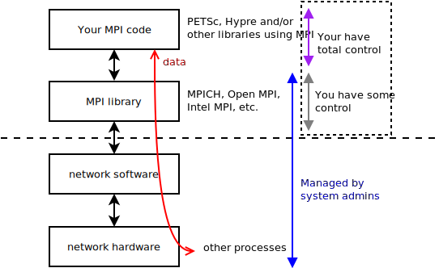

# Introduction


## MPI workshop series

1. Running MPI programs

    - MPI basics, different MPI implementations (libraries), MPI runtime system

    - From personal computer to HPC clusters (e.g. Hoffman2 Cluster)

2. MPI Programming

    - How to write basic MPI code

3. Introducting to PETSc

    - Develop MPI code for scientific computing

4. Paraview for Scientific Visulization

---

## What is MPI (Message Passing Interface)?

- Standardized interface for distributed-memory communication in parallel scientific computing

- [MPI 1.0](https://www.mpi-forum.org/docs/mpi-1.3/mpi-report-1.3-2008-05-30.pdf) released in 1994 (245 pages)

- [MPI 2.0](https://www.mpi-forum.org/docs/mpi-2.0/mpi2-report.pdf) released in 1997 (370 pages)

- [MPI 3.0](https://www.mpi-forum.org/docs/mpi-3.1/mpi31-report.pdf) released 2012 (868 pages)

- [MPI 4.0](https://www.mpi-forum.org/docs/mpi-4.0/mpi40-report.pdf) released 2021 (1139 pages)

- Enables **portable** parallel computing: from laptop computers to HPC clusters and supercomputers


## What's in the MPI Standard?

- The expected behavior of MPI function calls, e.g.

    - data transfer (communication) between processes

    - should an action be synchronized, or not, etc.

- The C/C++ and Fortran interfaces

    - The MPI libraries ("implementatoins") should conform to the standard

- What the MPI library implementers should follow

- Helps users to write standard-conforming code

- Non-official interfaces exist in pratice, e.g. Python, R and Julia


## MPI C/C++ Example

```cpp
#include <mpi.h>
#include <cstdio>
int main(int argc, char *argv[])
{
    int rank, nproc;
    MPI_Init(&argc, &argv);
    MPI_Comm_rank(MPI_COMM_WORLD, &rank);
    MPI_Comm_size(MPI_COMM_WORLD, &nproc);
    printf("hello world from MPI process %d of %d\n",rank,nproc);
    MPI_Finalize(); 
}
```

## MPI Fortran Example

```fortran
program hello
    use mpi
    integer rank, size, ierror
    call MPI_INIT(ierror)
    call MPI_COMM_SIZE(MPI_COMM_WORLD, size, ierror)
    call MPI_COMM_RANK(MPI_COMM_WORLD, rank, ierror)
    print*, 'Hello from process', rank, 'of', size
    call MPI_FINALIZE(ierror)
end
```

## Python Example

```python
from mpi4py import MPI

comm = MPI.COMM_WORLD
rank = comm.Get_rank()
size = comm.Get_size()
print("hello world from process ", rank, "of", size)
```


## Julia Example

```julia
using MPI

MPI.Init()
rank = MPI.Comm_rank(MPI.COMM_WORLD)
nproc = MPI.Comm_size(MPI.COMM_WORLD)
println("hello world, rank $rank of $nproc")
MPI.Finalize()
```

## General Structure of a MPI code

1. Header file

    - For C/C++/Fortran: header file for function prototypes

    - For Python/Julia: loading the module/package

2. Initialization (`MPI_Init`)

3. The body of your parallel code (including functions, subroutines, etc)

    - computation
    
    - communication (via MPI function calls)

4. Finalize (`MPI_Finalize`)


##

GNU compilers

| Language    | Compiler   | MPI Compiler |
|-------------|------------|--------------|
| C           |  `gcc`     |  `mpicc`     |
| C++         |  `g++`     | `mpicxx`     |
| Fortran 90  | `gfortran` | `mpif90`     |
| Fortran 77  | `gfortran` | `mpif77`     |


Intel compilers

| Language | Compiler   | MPI            |  GCC + Intel MPI |
|----------|------------|----------------|----------------|
| C        |  `icc`     | `mpiicc`       | `mpicc`        |
| C++      |  `icpc`    | `mpiicpc`      | `mpicxx`       |
| Fortran  |  `ifort`   | `mpiifort`     | `mpif90`       |


## Compiling and linking

MPI Compiler is a wrapper of the underlying compiler with flags to link to MPI libraries

```
$ which mpicc
/u/local/apps/mpich/3.4.3/bin/mpicc
```

```
$ mpicc -show
gcc -std=gnu99 -std=gnu99 -I/u/local/apps/mpich/3.4.3/include
 -L/u/local/apps/mpich/3.4.3/lib 
 -Wl,-rpath -Wl,/u/local/apps/mpich/3.4.3/lib 
 -Wl,--enable-new-dtags -lmpi
```


## Running MPI code

An MPI code must be started by `mpiexec` (or `mpirun`)

```bash
$ mpicxx hello.cpp   # generates a.out

$ mpiexec -n 4 ./a.out
hello world from MPI process 0 of 4
hello world from MPI process 1 of 4
hello world from MPI process 2 of 4
hello world from MPI process 3 of 4
```


# Message Passing Examples


## Message passing is data transfer between processes

{ height=70% }


## Sending an integer from process 0 to process 1

{ width=70% }


## Sending an interger from process 0 to process 1

```c
MPI_Comm_rank(MPI_COMM_WORLD, &rank);
MPI_Comm_size(MPI_COMM_WORLD, &np);
...
if (rank == 0) {
    x = -99;
    MPI_Send(&x, 1, MPI_INT, 1, 0, MPI_COMM_WORLD);
  } else if (rank == 1) {
    MPI_Recv(&x, 1, MPI_INT, 0, 0, MPI_COMM_WORLD, MPI_STATUS_IGNORE
}
```


[[Complete code: send_recv.c]](https://github.com/schuang/mpi-tutorial/blob/master/c/send_recv.cpp)

##

```
$ mpirun -n 2 ./a.out
rank=1: before receiving x = 32764
rank=1: after receiving x = -99
```


## Julia version


```julia
pid = MPI.Comm_rank(MPI.COMM_WORLD)
nproc = MPI.Comm_size(MPI.COMM_WORLD)
...
if pid == 0
    MPI.Send(data_src, dst, src, MPI.COMM_WORLD)
else pid == 1
    stat = MPI.Recv!(data_dst, src, src, MPI.COMM_WORLD)
end
```

## Observations: `MPI_Send` and `MPI_Recv`

- Each (MPI) process has its own independent memory address space

    - Nothing is "shared" among the processes in MPI; explicit communication is required

    - All processes run the same "copy" of the executable (e.g. a.out)

- MPI processes are identified by the "rank" (0, 1, ..., $N_p-1$)

    - rank ID from `MPI_Comm_rank(...)`

    - $N_p$ from `MPI_Comm_size(...)`


- Both the sending and receiving processes need to call MPI functions

    - `MPI_Send(...)` on the sending process

    - `MPI_Recv(...)` on the receiving process

    - MPI-3 defines the one-sided communication interface, but here we will stick to the basics


## Common patterns in MPI communication

1. No-communication/informational calls (e.g. `MPI_Comm_size()`)

2. One to one (point to point) communication
    
    - One process sends something to another

    - `MPI_Send()`/`MPI_Recv()` and their variants (e.g. `MPI_Isend`)

3. Collective communication

    - one to many: `MPI_Bcast()` or `MPI_Scatter()`

    - Many to one: `MPI_Gather()`

    - many to many: `MPI_Alltoall()`

If you understand `MPI_Send` and `MPI_Recv` (or their variants), you could implement collective communication youself, but using the (algorithmically optimized) MPI collective communication functions is recommended.

## MPI Broadcasting example

{ height=80% }


## Broadcasting example

Copy data from one process to all others

```c
if (rank==0) {
    x[0] = 1;
    x[1] = 2;
    x[2] = 3;
  }
...
MPI_Bcast(x,3,MPI_INT,0,MPI_COMM_WORLD);


```

[full code: bcast.c](https://github.com/schuang/mpi-tutorial/blob/master/c/bcast.cpp)


## MPI Gather: data from all processes into one process

{ height=30% }


```c
MPI_Gather(data,          /* send buffer (data source) */
	       N/nproc,       /* send count */
	       MPI_DOUBLE,    /* send type */
	       data_coll,     /* receive buffer (on rank=0, see below) */
	       N/nproc,       /* receive count */
	       MPI_DOUBLE,    /* receive type */
	       0,             /* receive on rank=0 */
	       MPI_COMM_WORLD /* communicator */ );
```
[full code: gather.c](https://github.com/schuang/mpi-tutorial/blob/master/c/gather.cpp)

## MPI_Scatter: distribute data among processes

{ height=30% }


```c
MPI_Scatter(data_src,       /* send buffer (data source) */
		N/nproc,           /* send count */
		MPI_INT,           /* send type */
		data,              /* receive buffer */
        N/nproc,           /* receive count */
		MPI_INT,           /* receive type */
		0,                 /* data source is rank=0 process */
		MPI_COMM_WORLD     /* communicator */ );
```

[full code: scatter.c](https://github.com/schuang/mpi-tutorial/blob/master/c/scatter.cpp)


# MPI Interface: A Closer Look


## General observatoins

- MPI interface was originally defined for C and Fortran77 languages

- Data types are required in MPI communication functions, e.g.

    ```
    MPI_Send(&x, 1, MPI_INT, 1, 0, MPI_COMM_WORLD);
    ```

- MPI defines data types mapped to types in programming languages

- High level languages (Python, Julia, and R) have "cleaner" MPI interface because some of attributes are embedded in the data so they don't need to be specified, e.g.

    - array size

    - data types


## MPI C/C++ data type examples

| C/C++ types | MPI Types |  data size  |
|-------------|-----------|------------|
| `int`       |  MPI_INT  |   32-byte integer |
| `long long int` | MPI_LONG_LONG_INT | 64-byte integer |
|`float`    | MPI_FLOAT |   32-byte floating point |
| `double`  | MPI_DOUBLE |  64-byte floating point |
| `float _Complex` | MPI_C_COMPLEX | 32*2-byte complex number |
| `double _Complex` | MPI_C_DOUBLE_COMPLEX | 64*2-byte complex number |


[See the full list](https://www.mpich.org/static/docs/v3.3/www3/Constants.html)

## MPI Fortran data type examples

| Fortran types | MPI Types | comments |
|---------------|-----------|----------|
| `integer`       | MPI_INTEGER | 32-byte integer |
| `integer*8`     | MPI_INTEGER8 | 64-byte integer | 
| `real`          | MPI_REAL    | 32-byte integer |
| `double precision` | MPI_DOUBLE_PRECISION | 64-byte integer |
| `complex` | MPI_COMPLEX | 32*2-byte complex |
| `complex*16` | MPI_DOUBLE_COMPLEX | 64*2-byte complex |

[See the full list](https://www.mpich.org/static/docs/v3.3/www3/Constants.html)

## MPI Derived data types

- One can define arbitrary data types in MPI using the constructor functions, e.g.

    - `MPI_Type_contiguous`: continuous chunk of data
    
    - `MPI_Type_vector`: strided vector
    
    - `MPI_Type_create_struct`: general "struct" data

    - `MPI_Type_commit`: commit the newly defined type

- Once defined, the derived data types are used like the built-in types.


## `MPI_Send`


## `MPI_Send`


```MPI_Send(buf, count, data_type, dest, tag, comm)```

- C/C++ example

    `MPI_Send(&x,1,MPI_INT,5,0,MPI_COMM_WORLD);`
    
- Fortran example
    
    `Call MPI_Send(x,n,MPI_INTEGER,5,0,MPI_COMM_WORLD,ierr)`

- Julia example
    
    `MPI.Send(buf, dest, tag, MPI.COMM_WORLD)`
    
- Python example
    
    `comm.Send(buf, dest, tag)`

## `MPI_Recv`


`MPI_Recv(buf, count, datatype, src, tag, comm, status)`

- C/C++ example

    `MPI_Recv(&x,1,MPI_INT,5,0,MPI_COMM_WORLD,&status);`


- Fortran example

    `call MPI_Recv(x,1,MPI_INTEGER,5,0,MPI_COMM_WORLD,status,ierr)`


- Julia example

    `status = MPI.Recv!(buf, src, tag, MPI.COMM_WORLD)`

- Python example

    `comm.Recv(buf, source, tag, status)`


## General observations

- MPI has hundreds of functions

    - In many cases, one needs only a small subset of them (around 10-20)

- Heads up for the variations of "similar" functionalities, but with better performance

    - `MPI_Send()` (blocking) vs. `MPI_Isend()` (non-blocking)

    - Code may be a bit more complex, but the performance or scalability gain may pay off

- The interface is quite consistent

    - Once you get passed the first few MPI functions, the rest $O(100)$ are "easy" to follow


# Parallelization (by examples)


## 1-D heat equation (as an example)

Math model -- partial differential equation in space $x$ and time $t$:
$$
\frac{\partial \phi}{\partial x} = \alpha\frac{\partial^2 \phi}{\partial x^2}
$$

in the domain $x \in [0,1]$ subject to $\phi |_{x=0}=1$, $\phi|_{x=1}=0$ and $\phi(t=0)=0$.

Consider the simple discretization:

$$
\frac{\phi^{n+1} - \phi^{n}}{\Delta t} = \frac{\phi_{i+1} -2 \phi_i + \phi_{i-1}}{\Delta x^2}
$$

We are going to update $\phi$ at every time step by

$$
\phi^{n+1}_{i} = \beta\phi^{n}_{i-1} + (1-2\beta)\phi^{n}_{i} + \beta\phi^{n}_{i+1}
$$


## Computational Grid - sequential version


Update $\phi$ for $i=2$ to $N-1$ in every time step:

$$
\phi^{n+1}_{i} = \beta\phi^{n}_{i-1} + (1-2\beta)\phi^{n}_{i} + \beta\phi^{n}_{i+1}
$$

Key observation:

To update $\phi_i$, we need the data from its "neighbors": $\phi_{i-1}$ and $\phi_{i+1}$.

$\Rightarrow$ The operations are localized, but not completely indepedent among  $\phi_i$ and $\phi_j$

## Computational Grid - MPI version


- Each process updates its own portion

    - process 0 updates i from 2 to 5, process 1 updates i from 6 to 9, etc.

    - parallel computing!

- What happens to $\phi_5$ on process 0 that needs $\phi_6$ on process 1?

    - Processes do not *automatically* share data with other processes

    - We need to transfer data from 6 (on process 1) to process 0 somehow, and vice versa. Similarily for other processes.


## Ghost points

{ height=20% }


{ height=70% }


## An Unstructured Example

For multi-dimensional or more complex problems, the partition can appear "messy" but managable in most cases.

Partition an "unstructured" graph/mesh into 4 parts:

{ height=65% }


##


Consider the connectivity graph/map on process X:

::: columns

:::: column

| Global ID |   Neighbor list      |
|-----------|----------------------|
| ...       |   ...                |
| 30        |   ...                |
| 34        |   30, 21, 35, **68** |
| 35        |   ...                |

::::

:::: column

{ height=50% }

::::

:::


- The data associated with 30, 21, 35 are local to process X

- The data of **68** is on another process

    - Requires MPI communication!


## Data layout and communication


{ height=60% }


- The data structure ("local array") contains the "internal" and "ghost" parts

- Use MPI communication to update/fill ghost data

- With ghost data, computational may proceed locally similiar to the sequential case

## Data layout - general observations

- Computers can only perform local (in-memory) computations

- When partitioning a global problem, "ghost" regions are created to compensate the effects of partitioning

    - For some problems, there is no ghost region, i.e. the parts can be computed completely independently (no MPI communication!)

- "Parallelizing" a problem amounts to figuring out:

    - the ghost regions

    - the indexings: to determine sending what data to which processes

- MPI Programming: implement the data communication using MPI interface

    - `MPI_Send`, `MPI_Recv`, etc.


## Summary

- MPI standard defines the interface for data communication

- The interfaces for different languages are slightly different, but follow the same principle

    - classical interface: C/C++ & Fortran
    - high-level languages: Python, Julia, R

- MPI programming amounts to

    - Partition the global problem

    - Indexing (or parametrizing) the ghost regions

        - The "effects" of converting a global problem into a bunch of local problems

        - MPI communication "compensates" these effects

    - Use the MPI functions to implement the communication

        - Mapping your communication patterns to the right MPI functions

    - Test, verify correctness and benchmark code performance


## References

- Code examples: [https://github.com/schuang/mpi-tutorial](https://github.com/schuang/mpi-tutorial)

- Using MPI, by Gropp, Lusk, and Skjellum [[Amazon link]](https://www.amazon.com/Using-MPI-Programming-Message-Passing-Engineering/dp/0262527391)
- [MPI reference: C/C++ and Fortran](https://www.mpich.org/static/docs/v3.4.x/)
- [MPI in Python: `mpi4py`](https://mpi4py.readthedocs.io/en/stable/index.html)
- [MPI in Julia: `MPI.jl`](https://juliaparallel.github.io/MPI.jl/stable/)

- [MPI in R](https://cran.r-project.org/web/packages/Rmpi/index.html)