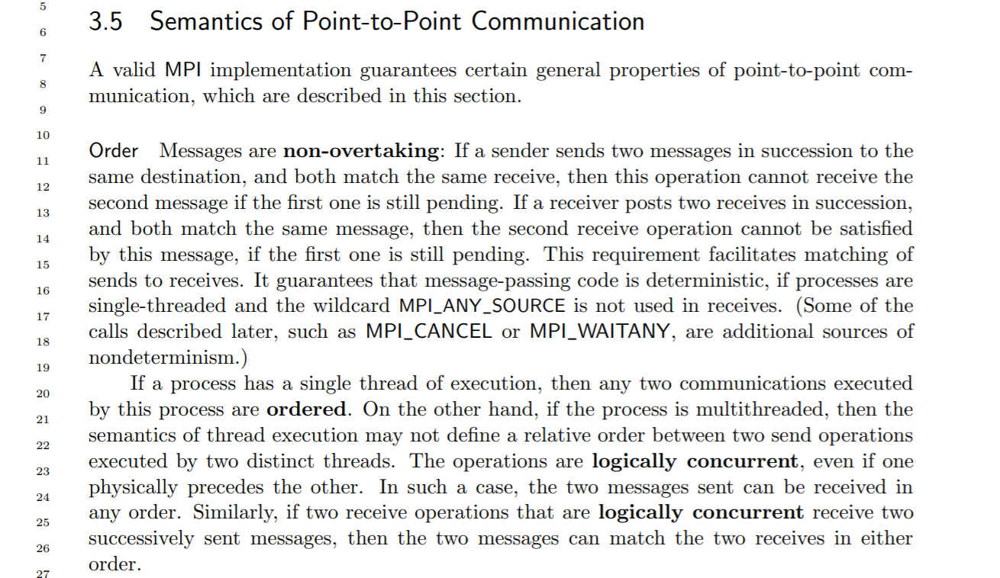
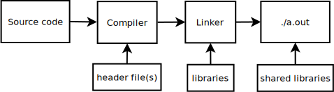
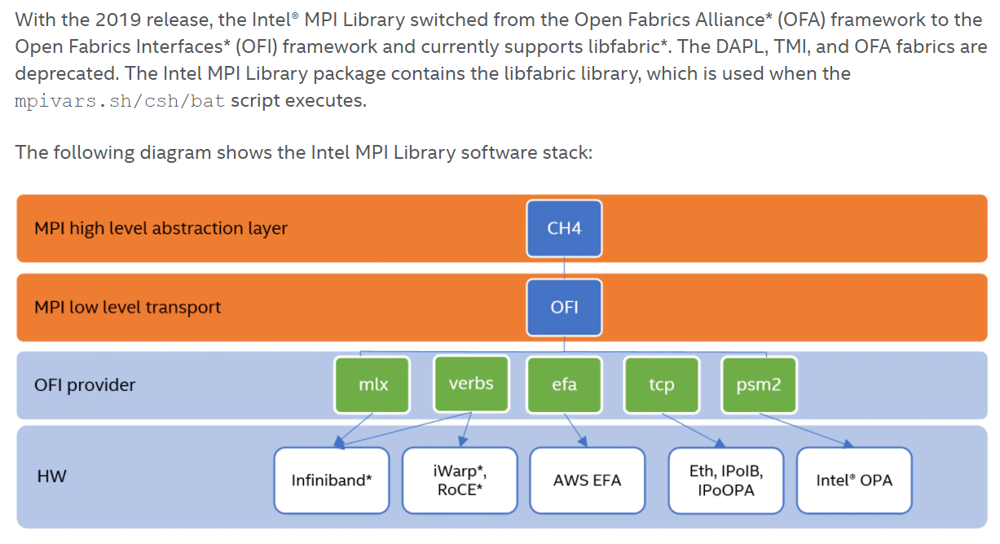
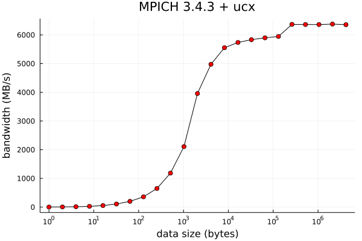
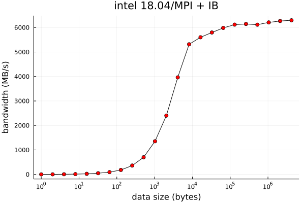
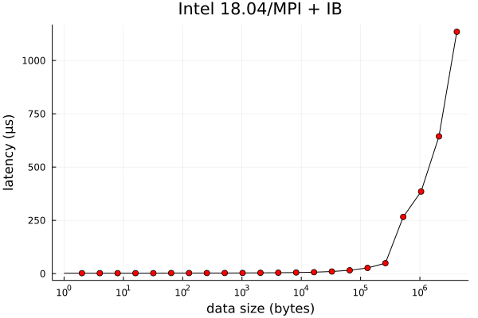
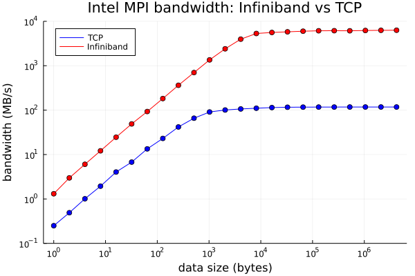
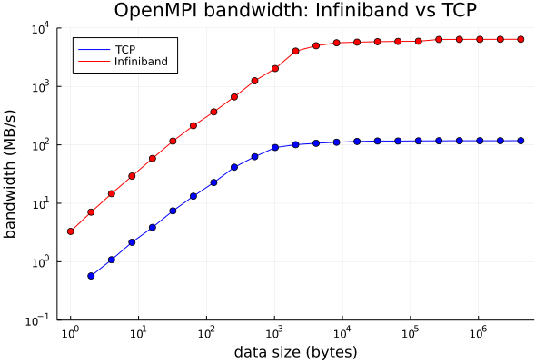

# MPI workshop series

1. Running MPI programs

    - MPI basics, different MPI implementations (libraries), MPI runtime system

    - From personal computer to HPC clusters (e.g. Hoffman2 Cluster)

2. MPI Programming

    - How to write an MPI code

3. Introducting to PETSc

    - Writing MPI code for scientific computing

---

# What is MPI (Message Passing Interface)?

- Standardized interface for distributed-memory communication in parallel scientific computing

- [MPI 1.0](https://www.mpi-forum.org/docs/mpi-1.3/mpi-report-1.3-2008-05-30.pdf) released in 1994 (245 pages)

- [MPI 2.0](https://www.mpi-forum.org/docs/mpi-2.0/mpi2-report.pdf) released in 1997 (370 pages)

- [MPI 3.0](https://www.mpi-forum.org/docs/mpi-3.1/mpi31-report.pdf) released 2012 (868 pages)

- [MPI 4.0](https://www.mpi-forum.org/docs/mpi-4.0/mpi40-report.pdf) released 2021 (1139 pages)

- Enables portable parallel computing: from laptop computers to HPC clusters and supercomputers


# What's in the MPI Standard?

- The expected behavior of MPI function calls, e.g.

    - data transfer (communication) between processes

    - should an action be synchronized, or not, etc.

- The C/C++ and Fortran interfaces

    - The MPI libraries ("implementatoins") should conform to the standard

- What the MPI library implementers should follow

- The understanding helps users to write standard-conforming code

- Non-official interfaces exist in pratice, e.g. Python, R and Julia


# An example

{ height=75% }

source: [MPI standard 4.0, p. 54](https://www.mpi-forum.org/docs/mpi-4.0/mpi40-report.pdf)


# MPI implementations (a.k.a. the MPI library/software)

There are two popular MPI implementations (among others):

- [**MPICH**](https://www.mpich.org/downloads/) (open source, "government license")
    
  [Intel MPI](https://www.intel.com/content/www/us/en/developer/tools/oneapi/mpi-library.html#gs.mpmlvx) (commercial)
    
  [MVAPICH](https://mvapich.cse.ohio-state.edu/downloads/) (open source, BSD license)

- [**Open MPI**](https://www.open-mpi.org/software/ompi/) (open source, BSD license)


Your MPI source code will/should remain the same no matter which one you use.

Their runtime systems can be slightly different. (more on this later)


# How a typical (sequential) program is compiled and run

{ width=80% }


# How an MPI program is compiled and run

{ width=95% }


- The user can transparently control how the processes are distributed.

- Processes communicate by making MPI calls (discussed in "MPI programming").


# The software stack schematic (overly simplified)

{ height=70% }


# UCX: Unified Communication X


source: [openucx.org](https://openucx.org)


# Intel MPI - OFI/OFA



source: [intel.com](intel.com)


# Where can you run MPI programs?

MPI is portable!

- Your laptop or desktop computers $\rightarrow$ for development and testing

  Easy on Mac and Linux
  
  Easy with Docker or virtual machine on MS-Windows

- Hoffman2 Cluster, or any other HPC clusters $\rightarrow$ for medium-size runs

- Supercomputers (e.g. NSF or DOE supercomputer centers) $\rightarrow$ for hero runs!

- Yes, you can install MPI libraries independently on any computers without "root" permission.


# MPI on Hoffman2 Cluster

There are 3 MPI libraries available on Hoffman2 cluster:

```
$ module avail intel/18.0.4
--------------------- /u/local/Modules/modulefiles -----------
intel/18.0.4
```

```
$ module avail openmpi/4.1
-------------------- /u/local/Modules/modulefiles ------------
openmpi/4.1
```

```
$ module avail mpich
-------------------- /u/local/Modules/modulefiles ------------
mpich/3.4(default)
```


# Installing MPICH on your computer (example)

[MPICH](https://www.mpich.org/downloads/) on Mac, Linux, or in a Linux Docker container or virtual machine on Windows:

```
wget http://www.mpich.org/static/downloads/3.4.1/mpich-3.4.1.tar.gz
tar xfz mpich-3.4.1.tar.gz
cd mpich-3.4.1

./configure CC=gcc CXX=g++ F77=gfortran
---prefix=$HOME/sw/mpich \
--enable-fortran=all --enable-cxx \
--enable-wrapper-rpath --enable-shared \
--with-device=ch4

make -j 4
make install
```

(Some details may vary depending on your system...)


# Installing OpenMPI on your computer (example)

[Open MPI](https://www.open-mpi.org/software/ompi/v4.1/) on Mac, Linux, or in a Linux Docker container or virtual machine on Windows:

```
wget https://download.open-mpi.org/release/open-mpi/v4.1/openmpi-4.1.2.tar.gz

tar xfz /u/local/downloads/openmpi/openmpi-4.1.2.tar.gz
cd openmpi-4.1.2

./configure CC=gcc CXX=g++ FC=gfortran \
            --prefix=$HOME/sw/openmpi \
             --enable-wrapper-rpath \
             --enable-orterun-prefix-by-default

make -j 4
make install
```
(Some details may vary depending on your system...)


# A note on high-speed networking on HPC clusters

To enable using the high-speed networking on HPC clusters, additional options are needed when building the MPI library.

MPI performance is relatively poor without using the high-speed networking.

- MPICH on Hoffman2 Cluster built with "UCX":

    ```
    ./configure CC=gcc CXX=g++ FC=gfortran F77=gfortran \
    ...
    --with-ucx=/u/local/apps/ucx/1.12 \
    ```

- OpenMPI on Hoffman2 Cluster built with "UCX":

    ```
    ./configure CC=gcc CXX=g++ FC=gfortran \
    --prefix=$INSTALL_DIR \
    ...
    --with-sge --without-verbs \
    --with-ucx=/u/local/apps/ucx/1.12
    ```


# Using OpenMPI 4.1 on Hoffman2 Cluster

```
$ module load openmpi/4.1
```

```
$ which mpicc
/u/local/mpi/openmpi/4.1.2/bin/mpicc
```

```
$ which mpiexec
/u/local/mpi/openmpi/4.1.2/bin/mpiexec
```

```
$ mpicc -showme
gcc -I/u/local/mpi/openmpi/4.1.2/include -pthread 
-L/u/local/mpi/openmpi/4.1.2/lib 
-Wl,-rpath -Wl,/u/local/mpi/openmpi/4.1.2/lib 
-Wl,--enable-new-dtags -lmpi
```


# Using MPICH 3.4 on Hoffman2 Cluster


```
$ module load mpich/3.4
```

```
$ which mpicc
/u/local/apps/mpich/3.4.3/bin/mpicc
```

```
$ which mpiexec
/u/local/apps/mpich/3.4.3/bin/mpiexec
```

```
$ mpicc -show
gcc -std=gnu99 -std=gnu99 -I/u/local/apps/mpich/3.4.3/include
 -L/u/local/apps/mpich/3.4.3/lib 
 -Wl,-rpath -Wl,/u/local/apps/mpich/3.4.3/lib 
 -Wl,--enable-new-dtags -lmpi
```


# Using Intel 18.04/MPI on Hoffman2 Cluster


Intel MPI integrate with different compilers under different commands:

| Languages   | GNU      |     Intel  |
|-------------|----------|------------|
| C           | `mpicc`  | `mpiicc`   |
| C++         | `mpicxx` | `mpiicpc`  |
| Fortran     | `mpif90` | `mpiifort` |


```
$ module load intel/18.04
```

```
$ which mpicc
/u/local/compilers/intel/18.0.4/compilers_and_libraries_2018.5.274/
linux/mpi/intel64/bin/mpicc
```

```
$ which mpiexec
/u/local/compilers/intel/18.0.4/compilers_and_libraries_2018.5.274/
linux/mpi/intel64/bin/mpiexec
```

# Intel Compiler wrapper details

Intel MPI with GNU C compiler:


# Intel Compiler wrapper details

Intel MPI with Intel C compiler:


# Why does one want to build MPI on Hoffman2 Cluster?

- Build a custom version with options not enabled in the system-wide MPI installation

- Test a particular version of MPI not available 

- Maintain your own software stack

# Advice on Building MPI codes

- Always use the same MPI library to build all of your codes (and the libraries they depend on)

- Bad things could happen when you use different MPI versions/variants for different parts

    - You could get lucky but ... please don't.


- For example, a user code `mycode.c` depends on PETSc (which depends on MPI) and MPI.

    - Use the same MPI to build the PETSc library
    - Use the same MPI to build your code (linked to PETSc etc.)
    - When submitting the job to run, load the same MPI version/variant


# Running our first MPI program!

The  [OSU MPI benchmark program](https://mvapich.cse.ohio-state.edu/benchmarks/) is a set of programs to perform a series of MPI benchmark tests.

The code is relatively easy to understand without specific science disciplines.

{ height=50% }

#

Building the [OSU benchmark](https://mvapich.cse.ohio-state.edu/benchmarks/) with MPICH:

```
tar xfz /u/local/downloads/osu-benchmarks/osu-micro-benchmarks-5.8.tgz
cd osu-micro-benchmarks-5.8

INSTALL_DIR=$HOME/osu-benchmarks/mpich

module purge
module load mpich/3.4

./configure CC=`which mpicc` CXX=`which mpicxx` \
--prefix=$INSTALL_DIR

make -j 4
make install
```

#

Building the [OSU benchmark](https://mvapich.cse.ohio-state.edu/benchmarks/) with OpenMPI:

```
INSTALL_DIR=$HOME/osu-benchmarks/openmpi

module purge
module load openmpi/4.1

./configure CC=`which mpicc` CXX=`which mpicxx` \
--prefix=$INSTALL_DIR

make -j 4
make install

```

#

Building the [OSU benchmark](https://mvapich.cse.ohio-state.edu/benchmarks/) with Intel MPI:

```
INSTALL_DIR=$HOME/osu-benchmarks/intelmpi

module purge
module load intel/18.0.4

./configure CC=`which mpicc` CXX=`which mpicxx` \
--prefix=$INSTALL_DIR

make -j 4
make install
```


# Infiniband networking for running OSU benchmarks

We will use two compute nodes with Intel E5-2670 CPUs with Infiniband FDR networking.

```
$ ibstat
CA 'mlx4_0'
CA type: MT4099
Number of ports: 1
Firmware version: 2.40.5030
...
Port 1:
        State: Active
        Physical state: LinkUp
        Rate: 56
        ...
        Link layer: InfiniBand
```

Note: 56 Gb/s $\rightarrow$ 7 GB/s


# MPICH with ucx (over Infiniband)

{ width=48% }
{ width=48% }

# OpenMPI with ucx (over Infiniband)

{ width=48% }
{ width=48% }


# Intel 18.04/MPI (over Infiniband)

{ width=48% }
{ width=48% }


# Intel MPI: Infiniband vs TCP (ethernet)

```
$ mpiexec -n 2 -machinefile mach a.out
$ mpiexec -genv I_MPI_FABRICS tcp -n 2 -machinefile mach a.out
```

{ height=45% }
{ height=45% }


# OpenMPI: Infiniband vs TCP

```
$ mpiexec -n 2 -machinefile mach a.out
$ mpiexec -n 2 --mca btl tcp,self --mca pml ob1 -machinefile mach a.out
```

{ height=45% }
{ height=45% }


# Machine file

- Specifies how the MPI processes are distributed across compute nodes

- Don't need the machine file when all processes are on the same compute nodes (e.g. on your PC)

MPICH/Intel MPI format:
```
n1:1
n2:1
```

OpenMPI format:
```
n1 slots=1
n2 slots=1
```

# Machine file on HPC cluster

- On an HPC cluster, the MPI jobs are managed by the job scheduler

- We don't know in advance what compute nodes will be used until the job is dispatched

- One may over-ride the process to use your own machine file

- We will demonstrate how to do this in the job script on Hoffman2 Cluster


# Considerations when running MPI jobs

**Factors:**

- The speed of an MPI job is determined by the slowest process

- Hoffman2 Cluster has different CPU models


**Suggested considerations:**

- Use the same/similar CPUs to run the MPI job

- Minimize scattering (if possible)


# Submitting a standard MPI job on Hoffman2 Cluster

Using `-pe dc*` allows the processes to distribute multiple nodes:

```
#!/bin/bash -l
#$ -j y
#$ -o stdout.$JOB_ID
#$ -l h_data=4G,h_rt=1:00:00
#$ -pe dc* 32
#$ -cwd

module load mpich/3.4    # or module load mpich/4.1 etc.
mpirun -n $SLOTS a.out
```

# 

Using `-pe shared` ensures all processes to run on ONE compute node:

```
#!/bin/bash -l
#$ -j y
#$ -o stdout.$JOB_ID
#$ -l h_data=4G,h_rt=1:00:00
#$ -pe shared 16
#$ -cwd

module load mpich/3.4
mpirun -n $SLOTS a.out
```

Of course, ``(-pe shared)*(h_data)`` cannot exceed a compute node's memory size.


# Specifying the CPU types

```
#!/bin/bash -l
#$ -j y
#$ -o stdout.$JOB_ID
#$ -l h_data=4G,h_rt=24:00:00
#$ -l arch=intel-E5-*
#$ -pe dc* 24
#$ -cwd

module load mpich/3.4
mpirun -n $SLOTS a.out
```


# Controlling the CPU types and number of processes per node

```
#!/bin/bash -l
#$ -j y
#$ -o stdout.$JOB_ID
#$ -l h_data=2G,h_rt=24:00:00
#$ -l arch=intel-E5-*,num_proc=16
#$ -l exclusive
#$ -pe dc* 48
#$ -cwd

module load mpich/3.4

# constructing machinefile: 8 processes per node
cat $PE_HOSTFILE |  awk '{print $1":8"}' > mach.$JOB_ID

# 8 procs per node for 48/16=3 nodes, so 24 MPI processes
mpirun -n 24 -machinefile mach.$JOB_ID a.out
```


# `PE_HOSTFILE`

- The environment variable `$PE_HOSTFILE` contains information about node allocation for the parallel job.

- Consider this run:

    ```
    #!/bin/bash -l
    #$ -j y
    #$ -o stdout.$JOB_ID
    #$ -l h_data=2G,h_rt=1:00:00
    #$ -pe dc* 48
    #$ -cwd

    module load mpich/3.4
    which mpiexec

    cat $PE_HOSTFILE > pehostfile.$JOB_ID
    ```

#

After the run, we get two files:

```
$ cat stdout.1380553
/u/local/apps/mpich/3.4.3/bin/mpiexec
```

```
$ cat pehostfile.1380553
n6365 24 pod_ib56_xgold.q@n6365 <NULL>
n7005 24 pod_ib56_xgold.q@n7005 <NULL>
```

# For MPICH/Intel MPI

- Using all allocated cores:
    
```
cat $PE_HOSTFILE | awk '{print $1":"$2}'
```

would be:

```
n6365:24
n7005:24
```

- Overriding the number of cores (normally with `-l exclusive`, use with care!), e.g.

```
cat $PE_HOSTFILE | awk '{print $1":8"}'
```
would be
```
n6365:8
n7005:8
```

# For Open MPI

- Using all allocated cores:

```
cat $PE_HOSTFILE | awk '{print $1" slots="$2}'
```

```
n6365 slots=24
n7005 slots=24
```

- Overriding the number of cores, (normally with `-l exclusive`, use with care!) e.g.

```
cat $PE_HOSTFILE | awk '{print $1" slots=8"}'
```

```
n6365 slots=8
n7005 slots=8
```


# Running Python/MPI code

In the context of MPI runtime, the program to run is "python mycode.py".

```
module load mpich/x.x.x
module load python/x.x.x
...
mpirun -n 8 python mycode.py
```

# Running Julia/MPI code


```
module load mpich/x.x.x
module load julia/x.x.x
...
mpirun -n 8 julia [some options] mycode.jl
```

# Debugging MPI code on Hoffman2 Cluster

- Using the print statements may be a straightforward way to debug

- Using a debugger is generally better

- Hoffman2 Cluster does not have a parallel debugger (e.g. TotalView)

- One can go quite far with `gdb` (a sequential debugger)

    - Attach one gdb to *each* MPI process
    - This is done easily with `xterm` (an X11 terminal program)

# Attaching gdb to MPI processes with xterm

- It may be difficult to manage too many xterm windows

- For many problems, it is possible to come with a test case with a small number of processes manifesting the bug(s).

- For best results, compile your code with debugging symbols included (`-g` option in GCC).

- Example:

    ```
    module load mpich/3.4
    ...
    mpirun -n 4 xterm -e gdb ./a.out
    ```

#


# Summary

- Understand MPI software stack

- Learn to install MPI on your computer(s)

    - Easier to develop and debug than HPC clusters

- Learn to use different MPI variants on Hoffman2 Cluster

    - Build code with MPI
    - Run code with MPI

- Work the job scheduler
    - Understand/use machine file to control process distribution


# Useful references

- [MPI Forum](https://www.mpi-forum.org/)

- [MPICH documentation](https://www.mpich.org/documentation/guides/)

- [OpenMPI documentation](https://www.open-mpi.org/doc/)

- [OpenMPI FAQ](https://www.open-mpi.org/faq/)

- [Intel 2018/MPI basic](https://www.intel.com/content/www/us/en/developer/articles/technical/tuning-the-intel-mpi-library-basic-techniques.html)

- [Intel 2018/MPI developer reference (pdf)](https://jp.xlsoft.com/documents/intel/mpi/2018/intelmpi-2018-developer-reference-linux.pdf)
